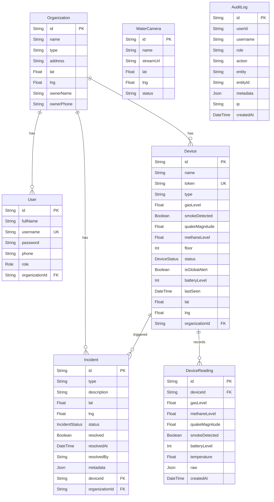
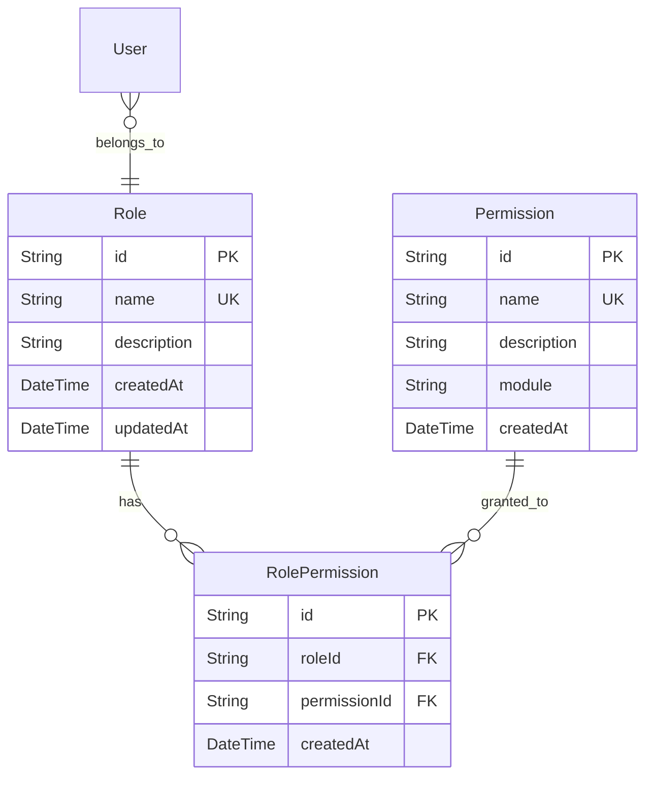

# 🔍 SERVER Backend — To'liq Tahlil

> **Loyiha:** МИСМ МЧС — Monitoring va Incident Response Platform  
> **Stack:** Node.js + Express + Prisma ORM + PostgreSQL + Socket.IO  
> **Tahlil sanasi:** 2026-06-15  
> **Tahlil manbasi:** [server/](file:///C:/Users/S.Farruhbek/WebstormProjects/secret/server) papkasi

---

## 📁 1. Folder Struktura Tahlili

### Hozirgi struktura

```
server/
├── .env                        # Muhit o'zgaruvchilari
├── .gitignore                  # Git uchun ignore
├── ecosystem.config.js         # PM2 konfiguratsiyasi
├── env.example                 # .env namunasi
├── new_sensor.json             # ⚠️ Test/debug fayl — productionda bo'lmasligi kerak
├── package.json                # Dependencies
├── prisma/
│   ├── schema.prisma           # Database schema
│   ├── seed.js                 # Seed ma'lumotlar
│   └── migrations/             # Migratsiya tarixi (11 ta)
├── prisma.config.ts            # Prisma CLI konfiguratsiyasi
└── src/
    ├── index.js                # Entry point (92 qator)
    ├── config/
    │   ├── db.js               # PrismaClient singleton
    │   └── prismaClient.js     # ⚠️ Dublikat — db.js ni re-export qiladi
    ├── constants/
    │   └── enums.js            # Role, Status, Type konstantalari
    ├── controllers/
    │   ├── authController.js       # Login
    │   ├── deviceController.js     # 355 qator — ⚠️ Juda katta
    │   ├── incidentController.js   # 172 qator
    │   ├── organizationController.js # 117 qator
    │   ├── statsController.js      # 45 qator
    │   ├── userController.js       # 99 qator
    │   └── auditLogController.js   # 29 qator
    ├── middlewares/
    │   └── authMiddleware.js   # JWT auth + role check
    ├── models/
    │   ├── user.js             # ⚠️ Faqat prisma.user re-export
    │   └── organization.js     # ⚠️ Faqat prisma.organization re-export
    ├── routes/
    │   ├── authRoutes.js          # POST /login
    │   ├── deviceRoutes.js        # CRUD + IoT
    │   ├── incidentRoutes.js      # CRUD + status
    │   ├── organizationRoutes.js  # CRUD
    │   ├── userRoutes.js          # CRUD
    │   ├── statsRoutes.js         # GET stats
    │   ├── mchsRoutes.js          # Dashboard + Global Alert
    │   ├── waterCameraRoutes.js   # Camera CRUD
    │   ├── geocodingRoutes.js     # Proxy to MapTiler
    │   ├── sensorRoutes.js        # Legacy sensor endpoint
    │   └── auditLogRoutes.js      # Audit log
    ├── services/
    │   ├── waterSafetyService.js  # AI API polling
    │   └── offlineDeviceService.js # Device offline checker
    └── utils/
        ├── analyzer.js         # ⚠️ Ishlatilmagan — dead code
        └── auditLog.js         # Audit log yordamchi
```

### ❌ Strukturadagi Muammolar

| Muammo | Tafsilot | Skill Reference |
|--------|----------|-----------------|
| `models/` papka foydasiz | Har bir fayl faqat `prisma.user` va `prisma.organization` ni re-export qiladi — bu arxitekturada hech qanday qiymat bermaydi | Clean Code: Dead code |
| `config/prismaClient.js` dublikat | `db.js` ni qayta export qiladi — ortiqcha fayl | Clean Code: DRY |
| `new_sensor.json` root-da | Test/debug fayl productionda bo'lmasligi kerak | Senior Mindset: Boy Scout Rule |
| `utils/analyzer.js` ishlatilmaydi | Hech bir faylda import qilinmagan — dead code | Clean Code: Dead code |
| Service layer yo'q | Controller-lar ichida biznes logika + DB call-lar birgalikda — Separation of Concerns buzilgan | Senior Mindset: SRP |
| Validatsiya middleware yo'q | Har bir controller o'zi validatsiya qiladi — DRY buzilgan | Senior Mindset: DRY |
| Global error handler yo'q | Har bir controller o'z try-catch-ini yozadi | Senior Mindset: Error handling |

---

## 🗄️ 2. Database Struktura Tahlili

### Schema diagrammasi



### ✅ Yaxshi tomonlari

| Element | Tavsif |
|---------|--------|
| UUID primary key | Barcha jadvallar `@default(uuid())` ishlatadi — tahmin qilib bo'lmaydi |
| Cascade deletes | Organization o'chirilsa, User va Device lar ham o'chadi |
| Indexes | `DeviceReading` va `AuditLog` da `@@index` mavjud |
| Enum types | `Role`, `DeviceStatus`, `IncidentStatus` — Prisma enum sifatida |
| `@updatedAt` | Avtomatik yangilanish vaqti |

### ❌ Muammolar

| Muammo | Jadval | Jiddiyligi | Tavsif |
|--------|--------|------------|--------|
| `resolved` + `status` dublikat | Incident | 🟡 O'rta | `status = RESOLVED` va `resolved = true` bir xil ma'no beradi — redundant field |
| `resolvedBy` — `String`, FK emas | Incident | 🔴 Jiddiy | User ga boglanmagan — referensial integrite yo'q |
| `WaterCamera.status` — String, enum emas | WaterCamera | 🟡 O'rta | Ixtiyoriy qiymat kiritilishi mumkin |
| `Organization.type` — String, enum emas | Organization | 🟡 O'rta | Validatsiya yo'q — "education", "EDU", "EDUCATION" — hammasi valid |
| `Device.type` — String, enum emas | Device | 🟡 O'rta | Enum qilish kerak |
| `AuditLog.userId` — FK emas | AuditLog | 🟡 O'rta | User jadvaliga bog'lanmagan |
| `DeviceReading` pagination yo'q | DeviceReading | 🟡 O'rta | Vaqt o'tishi bilan juda katta bo'ladi — arxivlash strategiyasi kerak |
| `Device` jadvalida index kam | Device | 🟡 O'rta | `organizationId`, `status`, `token` uchun index kerak |
| Migratsiya nomlari yomon | migrations/ | 🟡 O'rta | `"y"`, `""`, `"inite"` — noaniq nomlar |

---

## 🔐 3. Xavfsizlik Tahlili

### 3.1 Autentifikatsiya va Avtorizatsiya

**Auth middleware** ([authMiddleware.js](file:///C:/Users/S.Farruhbek/WebstormProjects/secret/server/src/middlewares/authMiddleware.js)):

```javascript
// SUPER_ADMIN може всё
if (user.role === ROLES.SUPER_ADMIN || allowedRoles.includes(user.role)) {
    req.user = user;
    next();
}
```

> [!WARNING]
> **JWT payload da token bekor qilinish mexanizmi yo'q.** Token 24 soat davomida valid — agar user o'chirilsa yoki roli o'zgartirilsa, eski token bilan ishlashda davom etadi.

| Tekshirilgan | Holat | Tavsif |
|:---|:---|:---|
| JWT signing | ✅ | `jsonwebtoken` kutubxonasi |
| Token muddati | ✅ | 24 soat (`expiresIn: '24h'`) |
| Password hashing | ✅ | `bcryptjs`, salt rounds = 10 |
| Login rate limit | ✅ | 15 daqiqada 30 ta urinish |
| JWT_SECRET tekshirish | ⚠️ | `console.warn` chiqadi, lekin server to'xtamaydi |
| Token blacklist/revoke | ❌ | Mavjud emas |
| Refresh token | ❌ | Mavjud emas |
| JWT payload da role | ⚠️ | Token ichida role saqlanadi — DB dan tekshirilmaydi |
| Password policy | ❌ | Minimal uzunlik, katta/kichik harf, raqam tekshiruvi yo'q |

### 3.2 Hujum Turlari bo'yicha Tekshiruv

#### 🔴 KRITIK — IoT Endpoint Himoyalanmagan

[deviceRoutes.js:7](file:///C:/Users/S.Farruhbek/WebstormProjects/secret/server/src/routes/deviceRoutes.js#L7):
```javascript
router.post('/iot/data', handleIotData); // ❌ Auth yo'q!
```

[sensorRoutes.js:20](file:///C:/Users/S.Farruhbek/WebstormProjects/secret/server/src/routes/sensorRoutes.js#L20):
```javascript
router.post('/', async (req, res) => { // ❌ Auth yo'q!
```

> [!CAUTION]
> `POST /api/devices/iot/data` va `POST /api/sensor-data` — bu ikkita endpoint **hech qanday autentifikatsiyasiz** ochiq. Har kim soxta telemetriya yuborishi, DANGER status trigger qilishi va soxta incidentlar yaratishi mumkin. Bu tizimning eng katta xavfsizlik teshigi.

#### Hujum Xaritasi

| Hujum turi | Holat | Tafsilot |
|:---|:---:|:---|
| **Soxta IoT Data** | 🔴 | Token bilsa, har kim soxta alarm yuboradi |
| **Brute Force Login** | 🟢 | Rate limit mavjud (15 daq/30 urinish) |
| **SQL Injection** | 🟢 | Prisma ORM parametrized queries ishlatadi |
| **NoSQL Injection** | 🟢 | SQL/Prisma — NoSQL emas |
| **XSS (Stored)** | 🟡 | Input sanitizatsiya yo'q — description, name, address larni to'g'ridan-to'g'ri saqlaydi |
| **CSRF** | 🟡 | CORS mavjud, lekin CSRF token yo'q |
| **SSRF** | 🟡 | Geocoding proxy MapTiler ga — boshqa URL ga redirect qilish mumkin emas |
| **Privilege Escalation** | 🔴 | User yaratishda `role` validatsiya qilinmaydi — ADMIN o'ziga SUPER_ADMIN role bera oladi |
| **IDOR** | 🔴 | Device/Incident ID bilsa, boshqa org ning resursi bilan ishlash mumkin |
| **DoS** | 🟡 | Rate limit faqat login da — boshqa endpoint larda yo'q |
| **Helmet Headers** | 🟢 | Helmet middleware mavjud |
| **CORS** | 🟢 | Origin whitelist konfiguratsiya qilingan |
| **JWT Secret** | ⚠️ | Default `.env` da `CHANGE_ME_TO_A_LONG_RANDOM_SECRET` — production da o'zgartirilishi shart |
| **Error Message Leaking** | 🔴 | `e.message` to'g'ridan-to'g'ri response ga qaytariladi ([authController.js:41](file:///C:/Users/S.Farruhbek/WebstormProjects/secret/server/src/controllers/authController.js#L41)) |
| **WebSocket Auth** | 🔴 | Socket.IO ulanishda auth yo'q — har kim subscribe qilishi mumkin |
| **Mass Assignment** | 🟡 | `req.body` to'g'ridan-to'g'ri Prisma ga uzatiladi — ortiqcha field lar kiritish mumkin |

### 3.3 Xavfsizlik bo'yicha Batafsil Topilmalar

#### 🔴 1. Privilege Escalation — Role Validatsiya Yo'q

[userController.js:36](file:///C:/Users/S.Farruhbek/WebstormProjects/secret/server/src/controllers/userController.js#L36):
```javascript
role: role || 'ORG_OPERATOR', // ❌ ADMIN user SUPER_ADMIN role bilan user yarata oladi
```

**Muammo:** `ADMIN` roli bilan `POST /api/users/create` chaqirilganda, body da `role: "SUPER_ADMIN"` yuborsa, yangi SUPER_ADMIN user yaratiladi.

#### 🔴 2. IDOR — Device va Incident larda Cross-Org Access

[deviceController.js:121-135](file:///C:/Users/S.Farruhbek/WebstormProjects/secret/server/src/controllers/deviceController.js#L121-L135):
```javascript
const deleteDevice = async (req, res) => {
    // ❌ Hech qanday ownership tekshirish yo'q!
    await prisma.device.delete({ where: { id: req.params.id } });
};
```

**Muammo:** `ADMIN` role ga ega user boshqa org ning device larini o'chira oladi.

#### 🔴 3. WebSocket — Autentifikatsiya Yo'q

[index.js:39-45](file:///C:/Users/S.Farruhbek/WebstormProjects/secret/server/src/index.js#L39-L45):
```javascript
const io = new Server(server, {
    cors: {
        origin: allowedOrigins,
        credentials: true,
        methods: ['GET', 'POST']
    }
    // ❌ Auth middleware yo'q! Har kim subscribe qila oladi
});
```

#### 🔴 4. Error Message Leak — Stack Trace

[authController.js:41](file:///C:/Users/S.Farruhbek/WebstormProjects/secret/server/src/controllers/authController.js#L41):
```javascript
res.status(500).json({ error: e.message }); // ❌ Internal error leak
```

[userController.js:53](file:///C:/Users/S.Farruhbek/WebstormProjects/secret/server/src/controllers/userController.js#L53):
```javascript
res.status(500).json({ error: `Failed to create user: ${e.message}` }); // ❌
```

#### 🟡 5. Input Sanitization Yo'q

Hech bir joyda HTML/script taglari tozalanmaydi. `description`, `name`, `address` kabi field-larga `<script>alert('xss')</script>` yozish mumkin.

#### 🟡 6. Global State — Memory Leak Xavfi

[waterSafetyService.js:44](file:///C:/Users/S.Farruhbek/WebstormProjects/secret/server/src/services/waterSafetyService.js#L44):
```javascript
global.lastWaterStatus = currentStatus; // ⚠️ Global state ishlatish anti-pattern
```
#### 🟡 7. `bcrypt.compareSync` — Event Loop Blocking

[authController.js:11](file:///C:/Users/S.Farruhbek/WebstormProjects/secret/server/src/controllers/authController.js#L11):
```javascript
if (!user || !bcrypt.compareSync(password, user.password)) {
    // ❌ compareSync event loop ni bloklaydi! await bcrypt.compare() kerak
}
```

**Muammo:** Sinxron bcrypt taqqoslash async handler ichida. Yuqori load da barcha so'rovlarni bloklaydi.

#### 🔴 8. Password Hash Leak — Organizations Endpoint

[organizationController.js:96](file:///C:/Users/S.Farruhbek/WebstormProjects/secret/server/src/controllers/organizationController.js#L96):
```javascript
const orgs = await prisma.organization.findMany({ 
    include: { users: true, devices: true }, // ❌ users: true — password hash qaytadi!
});
```

**Muammo:** `GET /api/organizations` barcha user obyektlarini, shu jumladan **bcrypt password hash** larini qaytaradi. `sanitizeUser` ishlatilmagan.

#### 🟡 9. API Key Console Log Leak

[geocodingRoutes.js:24](file:///C:/Users/S.Farruhbek/WebstormProjects/secret/server/src/routes/geocodingRoutes.js#L24):
```javascript
console.log(`[GEOCODING] Proxying request to: ${url}`); // ❌ MAPTILER_KEY logga tushadi!
```

#### 🟡 10. Bearer Prefix Tekshirilmaydi

[authMiddleware.js:9](file:///C:/Users/S.Farruhbek/WebstormProjects/secret/server/src/middlewares/authMiddleware.js#L9):
```javascript
const token = authHeader.split(' ')[1]; // ❌ "Basic xyz" ham qabul qiladi
```

#### 🟡 11. Device Token WebSocket orqali Broadcast

[deviceController.js:262](file:///C:/Users/S.Farruhbek/WebstormProjects/secret/server/src/controllers/deviceController.js#L262):
```javascript
io?.emit('sensor-update', {
    token: updated.token, // ❌ Device token barcha clientlarga yuboriladi!
    ...
});
```

#### 🟡 12. ORG_OPERATOR null orgId — Barcha Incidentlarni Ko'radi

[incidentController.js:20-21](file:///C:/Users/S.Farruhbek/WebstormProjects/secret/server/src/controllers/incidentController.js#L20-L21):
```javascript
if (user.role === 'ORG_OPERATOR' && user.orgId) {
    where.organizationId = user.orgId; // ❌ orgId null bo'lsa, filter yo'q!
}
```

#### 🟡 13. Pagination Yo'q — Performance Xavfi

| Endpoint | Muammo |
|----------|--------|
| `GET /api/devices` | Barcha device lar qaytadi — limit yo'q |
| `GET /api/users` | Barcha user lar qaytadi — limit yo'q |
| `GET /api/organizations` | Barcha org lar qaytadi — limit yo'q |

#### 🟡 14. Inconsistent REST API Naming

| Endpoint | Hozirgi | To'g'ri RESTful |
|----------|---------|-----------------|
| `POST /api/organizations/create` | ❌ | `POST /api/organizations` |
| `POST /api/users/create` | ❌ | `POST /api/users` |

#### 🟡 15. mchsRoutes — Try/Catch Yo'q

[mchsRoutes.js:8-12](file:///C:/Users/S.Farruhbek/WebstormProjects/secret/server/src/routes/mchsRoutes.js#L8-L12) va [mchsRoutes.js:28-37](file:///C:/Users/S.Farruhbek/WebstormProjects/secret/server/src/routes/mchsRoutes.js#L28-L37) — ikkala endpoint da try/catch yo'q. DB xato bersa, **unhandled promise rejection** bo'ladi.

---

## 🛣️ 4. Route & Controller Tahlili

### To'liq Route Xaritasi

| Method | Path | Auth | Rollar | Controller | Holat |
|:---|:---|:---:|:---|:---|:---|
| `POST` | `/api/auth/login` | ❌ | Hammaga | [authController.login](file:///C:/Users/S.Farruhbek/WebstormProjects/secret/server/src/controllers/authController.js#L6) | ✅ Rate limited |
| `GET` | `/api/devices` | ✅ | SA, A, MU, MO | [getAllDevices](file:///C:/Users/S.Farruhbek/WebstormProjects/secret/server/src/controllers/deviceController.js#L5) | ⚠️ Org filter yo'q |
| `POST` | `/api/devices` | ✅ | A, SA | [createDevice](file:///C:/Users/S.Farruhbek/WebstormProjects/secret/server/src/controllers/deviceController.js#L17) | ✅ |
| `PUT` | `/api/devices/:id` | ✅ | A, SA, OO | [updateDevice](file:///C:/Users/S.Farruhbek/WebstormProjects/secret/server/src/controllers/deviceController.js#L54) | ⚠️ ADMIN uchun org check yo'q |
| `DELETE` | `/api/devices/:id` | ✅ | SA, A | [deleteDevice](file:///C:/Users/S.Farruhbek/WebstormProjects/secret/server/src/controllers/deviceController.js#L121) | 🔴 IDOR |
| `GET` | `/api/devices/check/:id` | ✅ | SA, A, OO | [checkDeviceById](file:///C:/Users/S.Farruhbek/WebstormProjects/secret/server/src/controllers/deviceController.js#L151) | ⚠️ Org check yo'q |
| `GET` | `/api/devices/my-devices` | ✅ | OO, A | [getMyDevices](file:///C:/Users/S.Farruhbek/WebstormProjects/secret/server/src/controllers/deviceController.js#L137) | ✅ |
| `GET` | `/api/devices/:id/readings` | ✅ | SA, A, MU, OO, MO, HO | [getDeviceReadings](file:///C:/Users/S.Farruhbek/WebstormProjects/secret/server/src/controllers/deviceController.js#L174) | ✅ Org check bor |
| `POST` | `/api/devices/iot/data` | ❌ | **Hammaga** | [handleIotData](file:///C:/Users/S.Farruhbek/WebstormProjects/secret/server/src/controllers/deviceController.js#L331) | 🔴 **Auth yo'q** |
| `GET` | `/api/organizations` | ✅ | SA, A, MU, MO, OO | [getAllOrganizations](file:///C:/Users/S.Farruhbek/WebstormProjects/secret/server/src/controllers/organizationController.js#L89) | ⚠️ User passwords leak |
| `POST` | `/api/organizations/create` | ✅ | SA, A | [createOrganization](file:///C:/Users/S.Farruhbek/WebstormProjects/secret/server/src/controllers/organizationController.js#L9) | ✅ |
| `PUT` | `/api/organizations/:id` | ✅ | SA, A | [updateOrganization](file:///C:/Users/S.Farruhbek/WebstormProjects/secret/server/src/controllers/organizationController.js#L61) | ✅ |
| `DELETE` | `/api/organizations/:id` | ✅ | SA | [deleteOrganization](file:///C:/Users/S.Farruhbek/WebstormProjects/secret/server/src/controllers/organizationController.js#L104) | ✅ |
| `GET` | `/api/users` | ✅ | SA, A | [getAllUsers](file:///C:/Users/S.Farruhbek/WebstormProjects/secret/server/src/controllers/userController.js#L11) | ✅ Password filter bor |
| `POST` | `/api/users/create` | ✅ | SA, A | [createUser](file:///C:/Users/S.Farruhbek/WebstormProjects/secret/server/src/controllers/userController.js#L20) | 🔴 Role escalation |
| `PUT` | `/api/users/:id` | ✅ | SA, A | [updateUser](file:///C:/Users/S.Farruhbek/WebstormProjects/secret/server/src/controllers/userController.js#L57) | 🔴 Role escalation |
| `DELETE` | `/api/users/:id` | ✅ | SA | [deleteUser](file:///C:/Users/S.Farruhbek/WebstormProjects/secret/server/src/controllers/userController.js#L84) | ⚠️ Self-delete mumkin |
| `GET` | `/api/incidents` | ✅ | SA, MU, A, MO, OO | [listIncidents](file:///C:/Users/S.Farruhbek/WebstormProjects/secret/server/src/controllers/incidentController.js#L14) | ✅ Org filter bor |
| `POST` | `/api/incidents` | ✅ | SA, MU, A, MO, OO | [createIncident](file:///C:/Users/S.Farruhbek/WebstormProjects/secret/server/src/controllers/incidentController.js#L46) | ✅ |
| `PATCH` | `/api/incidents/:id/resolve` | ✅ | SA, MU | [resolveIncident](file:///C:/Users/S.Farruhbek/WebstormProjects/secret/server/src/controllers/incidentController.js#L91) | ✅ |
| `PATCH` | `/api/incidents/:id/status` | ✅ | SA, MU, A, OO | [updateIncidentStatus](file:///C:/Users/S.Farruhbek/WebstormProjects/secret/server/src/controllers/incidentController.js#L124) | ✅ FSM bor |
| `GET` | `/api/stats` | ✅ | SA, MU, A | [getStats](file:///C:/Users/S.Farruhbek/WebstormProjects/secret/server/src/controllers/statsController.js#L4) | ✅ |
| `GET` | `/api/mchs/dashboard` | ✅ | MU | mchsRoutes inline | ⚠️ Error handling yo'q |
| `GET` | `/api/mchs/global-alert/status` | ✅ | MU, SA, OO, A | mchsRoutes inline | ✅ |
| `POST` | `/api/mchs/global-alert` | ✅ | MU, SA | mchsRoutes inline | ⚠️ Error handling yo'q |
| `GET` | `/api/water-camera` | ✅ | SA, MU, HO | waterCameraRoutes inline | ✅ |
| `POST` | `/api/water-camera` | ✅ | SA, MU, HO | waterCameraRoutes inline | ✅ |
| `GET` | `/api/geocoding/search` | ✅ | SA, MU, MO | geocodingRoutes inline | ✅ |
| `GET` | `/api/sensor-data` | ✅ | SA, MU, A, OO | sensorRoutes inline | ✅ |
| `POST` | `/api/sensor-data` | ❌ | **Hammaga** | sensorRoutes inline | 🔴 **Auth yo'q** |
| `GET` | `/api/audit-logs` | ✅ | SA | [listAuditLogs](file:///C:/Users/S.Farruhbek/WebstormProjects/secret/server/src/controllers/auditLogController.js#L3) | ✅ |

> **Rollar:** SA=SUPER_ADMIN, A=ADMIN, MU=MCHS_USER, OO=ORG_OPERATOR, MO=MAP_OPERATOR, HO=HAZARD_OPERATOR

---

## 🧹 5. Clean Code Tahlili (Skills bo'yicha)

### 5.1 Naming Muammolari

| Fayl | Muammo | Tavsiya |
|------|--------|---------|
| [db.js](file:///C:/Users/S.Farruhbek/WebstormProjects/secret/server/src/config/db.js) | `db.js` nomi noaniq — nima uchun `db`? | `prismaClient.js` ga o'zgartirish |
| [analyzer.js](file:///C:/Users/S.Farruhbek/WebstormProjects/secret/server/src/utils/analyzer.js) | `analyzeData` — nima analyze qiladi? | `analyzeSensorTelemetry` |
| Controllers | `e` o'zgaruvchisi hamma joyda | `error` yoki aniq nom |
| Enums | Constants to'g'ri nomlangan ✅ | — |

### 5.2 Funksiya Hajmi va SRP

> [!WARNING]
> [deviceController.js](file:///C:/Users/S.Farruhbek/WebstormProjects/secret/server/src/controllers/deviceController.js) — **355 qator, 9 ta funksiya.** Bu fayl juda katta va bir nechta vazifani bajaradi: CRUD, IoT data processing, incident creation, socket emit.

**`processIotData` funksiyasi** (215-329 qator, **114 qator**) — eng katta muammo:
1. Device ni DB dan topadi
2. Sensor ma'lumotlarini parse qiladi
3. Statusni hisoblaydi
4. Device ni yangilaydi
5. DeviceReading yozadi
6. Socket event emit qiladi (device-update, sensor-update)
7. Incident yaratadi
8. Alert emit qiladi
9. Audit log yozadi
10. Sensor-alarm emit qiladi

> Bu **10 ta mustaqil vazifa** bitta funksiyada — **SRP ning jiddiy buzilishi**.

### 5.3 DRY Buzilishlari

| Nima takrorlanadi | Qayerda | Necha marta |
|:-|:-|:-:|
| Try-catch + `res.status(500).json({ error: ... })` | Har bir controller funksiya | ~25 marta |
| `Number.isFinite(parsedLat)` validatsiya | deviceController, incidentController, waterCameraRoutes | 4 marta |
| Audit log yaratish pattern | Har bir CRUD operatsiya | ~15 marta |
| `req.io?.emit(...)` pattern | deviceController, incidentController, mchsRoutes | ~8 marta |
| Organization ownership check | deviceController, incidentController | 3 marta |

### 5.4 Magic Numbers va Literals

| Qiymat | Fayl | Qator | Muammo |
|:---|:---|:---:|:---|
| `30` | deviceController.js | 228 | Gas danger threshold |
| `10` | deviceController.js | 229 | Gas warning threshold |
| `4.0` | deviceController.js | 228 | Quake magnitude threshold |
| `5 * 60 * 1000` | deviceController.js | 162 | Device connection timeout |
| `2000` | deviceController.js | 205 | Max readings per query |
| `500` | incidentController.js | 38 | Max incidents limit |
| `100` | auditLogController.js | 19 | Max audit logs limit |
| `10` | userController.js | 30 | bcrypt salt rounds |
| `'24h'` | authController.js | 28 | JWT expiry |

### 5.5 Dead Code

| Fayl | Tavsif |
|------|--------|
| [analyzer.js](file:///C:/Users/S.Farruhbek/WebstormProjects/secret/server/src/utils/analyzer.js) | **Hech qayerda import qilinmagan** — butun fayl dead code |
| [prismaClient.js](file:///C:/Users/S.Farruhbek/WebstormProjects/secret/server/src/config/prismaClient.js) | Faqat `db.js` ni re-export qiladi — ortiqcha |
| [models/user.js](file:///C:/Users/S.Farruhbek/WebstormProjects/secret/server/src/models/user.js) | `prisma.user` ni re-export — ortiqcha layer |
| [models/organization.js](file:///C:/Users/S.Farruhbek/WebstormProjects/secret/server/src/models/organization.js) | `prisma.organization` ni re-export — ortiqcha layer |
| Commented out console.log lar | waterSafetyService.js da | 🟡 |

### 5.6 Error Handling Muammolari

> [!IMPORTANT]
> Error handling **eng katta arxitektura kamchiligi**. Global error handler yo'q, har bir funksiya o'z try-catch ini yozadi, va xato xabarlari inconsistent.

```javascript
// ❌ Pattern 1: e.message leak (xavfsizlik xavfi)
res.status(500).json({ error: e.message });

// ❌ Pattern 2: Generic error (debugging qiyin)
res.status(500).json({ error: 'Failed to load devices' });

// ❌ Pattern 3: Error handling yo'q (mchsRoutes.js:8-12)
router.get('/dashboard', checkRole([ROLES.MCHS_USER]), async (req, res) => {
    const devices = await prisma.device.findMany({ include: { organization: true } });
    const cameras = await prisma.waterCamera.findMany();
    res.json({ devices, cameras });
    // ❌ try-catch yo'q — unhandled rejection!
});
```

### 5.7 Inline Route Handlers

> [!NOTE]
> `mchsRoutes.js`, `waterCameraRoutes.js`, `geocodingRoutes.js`, `sensorRoutes.js` — bu route fayllar ichida biznes logika to'g'ridan-to'g'ri yozilgan. Bu **Separation of Concerns** prinsipini buzadi. Route fayllar faqat routing qilishi kerak.

---

## 🏗️ 6. Arxitektura Tahlili

### Hozirgi Arxitektura

```
┌─────────────────────────────────────────────────────────────┐
│                      index.js (Entry Point)                 │
├─────────────────────────────────────────────────────────────┤
│  Routes → Controllers → Prisma (Direct DB Access)          │
│  ⚠️ No Service Layer                                        │
│  ⚠️ No Validation Layer                                     │
│  ⚠️ No Error Handling Layer                                  │
└─────────────────────────────────────────────────────────────┘
```

### Muammolar Xulosasi

| Prinsip | Holat | Tafsilot |
|---------|:-----:|---------|
| **SRP** | ❌ | Controllers biznes logika + DB + socket emit qiladi |
| **Separation of Concerns** | ❌ | Route fayllarida biznes logika bor |
| **DRY** | ❌ | Validatsiya, error handling, audit logging takrorlanadi |
| **KISS** | ⚠️ | `processIotData` juda murakkab — 10 ta vazifa |
| **Defensive Programming** | ❌ | Input validatsiya minimal, null check lar yo'q |
| **Boy Scout Rule** | ❌ | Dead code, dublikat fayllar, test data productionda |
| **Error Handling** | ❌ | Global handler yo'q, inconsistent pattern-lar |

---

## 📊 7. Umumiy Baho

### Xavfsizlik Bahosi: 3/10

```
🔴 Kritik:    7 ta (IoT auth x2, role escalation, IDOR, WebSocket auth, 
                     JWT alg confusion, password hash leak, device token plaintext)
🟡 O'rta:     10 ta (XSS, CSRF, DoS, mass assignment, error leak, bcrypt sync,
                      API key log, Bearer validation, null orgId bypass, no pagination)
🟢 Yaxshi:    5 ta (CORS, Helmet, Rate limit, SQL injection safe, UUID)
```

### Kod Sifati Bahosi: 4/10

```
🔴 Jiddiy:    4 ta (SRP buzilishi, service layer yo'q, global error handler yo'q,
                     processIotData 10 ta vazifa)
🟡 O'rta:     8 ta (DRY, magic numbers, dead code, inline handlers, naming,
                     REST naming inconsistent, mchsRoutes try/catch yo'q, tests yo'q)
🟢 Yaxshi:    4 ta (Prisma ORM, enum constants, audit logging, Socket.IO integration)
```

---

## 🚀 8. Migratsiya Rejasi — Sizning Arxitekturangizga O'tkazish

### Maqsadli Arxitektura

```
┌────────────────────────────────────────────────────────────┐
│                        index.js                            │
│  ┌──────────────────────────────────────────────────────┐  │
│  │  Global Middleware Stack                              │  │
│  │  helmet → cors → json → requestLogger → errorHandler │  │
│  └──────────────────────────────────────────────────────┘  │
├────────────────────────────────────────────────────────────┤
│  Routes Layer (faqat routing)                              │
│  ┌────────────────────────────────────────────────────┐    │
│  │  Validation Middleware (Joi/Zod schemas)            │    │
│  │  Auth Middleware (JWT + Role + Token Revocation)    │    │
│  └────────────────────────────────────────────────────┘    │
├────────────────────────────────────────────────────────────┤
│  Controller Layer (request/response only)                  │
├────────────────────────────────────────────────────────────┤
│  Service Layer (biznes logika)                             │
├────────────────────────────────────────────────────────────┤
│  Repository Layer (DB access — Prisma)                     │
├────────────────────────────────────────────────────────────┤
│  Domain Layer (enums, errors, types)                       │
└────────────────────────────────────────────────────────────┘
```

### Maqsadli Folder Struktura

```
server/
├── .env
├── .env.example
├── ecosystem.config.js
├── package.json
├── prisma/
│   ├── schema.prisma
│   ├── seed.js
│   └── migrations/
└── src/
    ├── index.js                    # Entry point
    ├── app.js                      # Express app setup
    ├── config/
    │   ├── env.js                  # Environment validation
    │   ├── prisma.js               # Prisma singleton
    │   └── socket.js               # Socket.IO setup
    ├── constants/
    │   ├── roles.js                # Role enums
    │   ├── deviceStatuses.js       # Device status enums
    │   ├── incidentStatuses.js     # Incident status enums
    │   └── thresholds.js           # Sensor thresholds (magic numbers)
    ├── errors/
    │   ├── AppError.js             # Custom error class
    │   ├── NotFoundError.js
    │   ├── ForbiddenError.js
    │   └── ValidationError.js
    ├── middlewares/
    │   ├── authenticate.js         # JWT verification
    │   ├── authorize.js            # Role checking
    │   ├── validate.js             # Request body validation
    │   ├── errorHandler.js         # Global error handler
    │   └── requestLogger.js        # Request logging
    ├── validations/
    │   ├── authSchema.js
    │   ├── deviceSchema.js
    │   ├── userSchema.js
    │   ├── organizationSchema.js
    │   └── incidentSchema.js
    ├── controllers/
    │   ├── authController.js
    │   ├── deviceController.js
    │   ├── incidentController.js
    │   ├── organizationController.js
    │   ├── userController.js
    │   ├── statsController.js
    │   ├── mchsController.js       # mchsRoutes dan ajratish
    │   ├── waterCameraController.js
    │   ├── geocodingController.js
    │   ├── sensorController.js
    │   └── auditLogController.js
    ├── services/
    │   ├── authService.js
    │   ├── deviceService.js
    │   ├── iotDataService.js       # processIotData ni ajratish
    │   ├── incidentService.js
    │   ├── organizationService.js
    │   ├── userService.js
    │   ├── statsService.js
    │   ├── mchsService.js
    │   ├── waterSafetyService.js   # Polling service
    │   ├── offlineDeviceService.js
    │   └── auditLogService.js
    ├── repositories/               # Yangi qatlam
    │   ├── deviceRepository.js
    │   ├── userRepository.js
    │   ├── organizationRepository.js
    │   ├── incidentRepository.js
    │   └── auditLogRepository.js
    ├── routes/
    │   ├── index.js                # Route aggregator
    │   ├── authRoutes.js
    │   ├── deviceRoutes.js
    │   ├── incidentRoutes.js
    │   ├── organizationRoutes.js
    │   ├── userRoutes.js
    │   ├── statsRoutes.js
    │   ├── mchsRoutes.js
    │   ├── waterCameraRoutes.js
    │   ├── geocodingRoutes.js
    │   ├── sensorRoutes.js
    │   └── auditLogRoutes.js
    └── utils/
        ├── sanitize.js             # Input sanitization
        ├── password.js             # Password hashing/policy
        └── token.js                # JWT helpers
```

### Qadam-baqadam Reja

#### Phase 1: Xavfsizlik Tuzatishlari (Birinchi!)

```diff
+ 1. IoT endpoint ga device token autentifikatsiyasi qo'shish
+ 2. Role escalation ni to'xtatish — role validatsiya middleware
+ 3. WebSocket ga JWT auth qo'shish
+ 4. Global error handler qo'shish
+ 5. Error message leak ni to'xtatish
+ 6. Password policy qo'shish (min 8 char, complexity)
+ 7. IDOR fix — ownership check barcha CRUD larga
+ 8. Input sanitization middleware (xss filter)
```

#### Phase 2: Arxitektura Refaktoring

```diff
+ 1. Service layer yaratish — controller dan biznes logikani ajratish
+ 2. Global error handler + custom AppError class
+ 3. Validation middleware (Joi yoki Zod)
+ 4. processIotData ni 5 ta kichik funksiyaga bo'lish
+ 5. Inline route handlers ni controller ga ko'chirish
+ 6. Dead code o'chirish (analyzer.js, prismaClient.js, models/)
+ 7. Magic numbers ni constants ga ko'chirish
+ 8. Rate limiting barcha endpoint larga
```

#### Phase 3: Database Optimallashtirish

```diff
+ 1. Index qo'shish: Device(organizationId, status, token)
+ 2. Incident.resolvedBy ni FK qilish
+ 3. Organization.type ni enum qilish
+ 4. Device.type ni enum qilish
+ 5. Incident.resolved field ni o'chirish (status bilan dublikat)
+ 6. DeviceReading uchun retention/arxivlash strategiyasi
+ 7. WaterCamera.status ni enum qilish
```

#### Phase 4: Production Readiness

```diff
+ 1. Environment validatsiya (envalid yoki dotenv-safe)
+ 2. Structured logging (winston yoki pino)
+ 3. Health check endpoint kengaytirish (DB, Redis, etc.)
+ 4. Graceful shutdown (SIGTERM handler)
+ 5. Request ID (correlation ID) qo'shish
+ 6. Test coverage (unit + integration)
+ 7. API documentation (Swagger/OpenAPI)
+ 8. Docker + docker-compose
```

---

## 🔬 9. Qo'shimcha Chuqur Tahlil Natijalari

### 🔴 JWT Algorithm Confusion Attack

[authMiddleware.js:10](file:///C:/Users/S.Farruhbek/WebstormProjects/secret/server/src/middlewares/authMiddleware.js#L10):
```javascript
jwt.verify(token, process.env.JWT_SECRET, (err, user) => {
    // ❌ Algoritm ko'rsatilmagan — "alg: none" hujumiga ochiq!
});
```

> [!CAUTION]
> `jwt.verify()` da `{ algorithms: ['HS256'] }` ko'rsatilmagan. Tajovuzkor `alg: "none"` bilan token yaratib, autentifikatsiyani chetlab o'tishi mumkin. Bu **KRITIK** zaiflik.

**To'g'rilash:**
```javascript
jwt.verify(token, process.env.JWT_SECRET, { algorithms: ['HS256'] }, (err, user) => { ... });
```

### 🔴 Device Token Plaintext Saqlanadi

[schema.prisma:66](file:///C:/Users/S.Farruhbek/WebstormProjects/secret/server/prisma/schema.prisma#L66):
```prisma
token String @unique  // ❌ Plaintext!
```

DB kompromatsiya bo'lsa, barcha device tokenlar ochiq ko'rinadi. Token lar parol kabi hash qilinishi kerak.

### 🔴 JWT_SECRET Yo'q Bo'lsa Server To'xtamaydi

[index.js:47-49](file:///C:/Users/S.Farruhbek/WebstormProjects/secret/server/src/index.js#L47-L49):
```javascript
if (!process.env.JWT_SECRET || process.env.JWT_SECRET.includes('CHANGE_IT')) {
    console.warn('[CONFIG] JWT_SECRET is missing or uses a placeholder value.');
    // ❌ Server ishlashda davom etadi! process.exit(1) kerak
}
```

### 🟡 Resource Management Muammolari

| Muammo | Fayl | Xavf |
|--------|------|------|
| `setInterval` hech qachon `clearInterval` qilinmaydi | waterSafetyService.js, offlineDeviceService.js | Test muhitida memory leak |
| `fetch()` da timeout yo'q | waterSafetyService.js:30 | AI API hang qilsa, so'rovlar to'planib ketadi |
| `prisma.waterCamera.findFirst()` har 3 soniyada | waterSafetyService.js:19 | O'zgarmas data uchun keraksiz DB query — keshlanishi kerak |
| `trust proxy` o'rnatilmagan | index.js | `req.ip` reverse proxy IP ni qaytaradi, audit log noto'g'ri |
| Race condition: findMany → updateMany | offlineDeviceService.js:12-26 | Device orasida onlayn bo'lishi mumkin — atomic query kerak |

### 🟡 Seed Fayl Xavfsizlik Risklari

| Muammo | Qator |
|--------|:-----:|
| Barcha userlar uchun parol `'123'` | 15 |
| Parol konsolga chop etiladi | 56 |
| Device token `"TOKEN-001"` — taxmin qilish oson | 44 |
| `deleteMany` — production da barcha data o'chadi | 8-12 |
| Idempotent emas — `upsert` o'rniga `delete+create` | — |

---

## ✅ Pre-Commit Checklist (Sizning Skill laringizdan)

Har bir commit dan oldin tekshiring:

- [ ] Har bir funksiya/class bitta vazifani bajaradimi? (SRP)
- [ ] Takrorlangan logika bormi? (DRY)
- [ ] Barcha xatolar handle qilinganmi? (`catch (e) {}` yo'qmi?)
- [ ] `null` / `undefined` holatlari hisobga olinganmi?
- [ ] Commentlar "nima uchun" ni tushuntiradimi, "nima" ni emas?
- [ ] Bu eng oddiy yechimmi? (KISS)
- [ ] Magic number lar named constant bilan almashtirilganmi?
- [ ] Faylni topganingizdan tozaroq qoldirdingizmi? (Boy Scout Rule)

---

---

> [!TIP]
> **Birinchi qadam:** Phase 1 xavfsizlik tuzatishlarini bajaring — bu eng muhim. Keyin Phase 2 arxitektura refaktoringiga o'ting. Har bir fazani alohida git branch da bajaring.

---

## 🏛️ 10. Role-Permission Arxitekturasi (RBAC)

### ❌ Hozirgi Muammo — Rollar Route-larda Hardcode

Hozirgi kodda har bir route da rollar **qo'lda yozilgan**:

```javascript
// ❌ Hozirgi — 30+ route da rollar ro'yxati takrorlanadi
router.get('/', checkRole([ROLES.SUPER_ADMIN, ROLES.ADMIN, ROLES.MCHS_USER, ROLES.MAP_OPERATOR]), getAllDevices);
router.post('/', checkRole([ROLES.ADMIN, ROLES.SUPER_ADMIN]), createDevice);
router.put('/:id', checkRole([ROLES.ADMIN, ROLES.SUPER_ADMIN, ROLES.ORG_OPERATOR]), updateDevice);
router.delete('/:id', checkRole([ROLES.SUPER_ADMIN, ROLES.ADMIN]), deleteDevice);
```

**Bu yondashuvning muammolari:**

| Muammo | Tavsif |
|--------|--------|
| 🔴 Hardcoded rollar | Yangi rol qo'shsangiz, **barcha route fayllarni** o'zgartishingiz kerak |
| 🔴 DRY buzilishi | Bir xil rollar ro'yxati 30+ joyda takrorlanadi |
| 🔴 Moslashuvchan emas | Admin paneldan rollarni boshqarib bo'lmaydi |
| 🔴 Kengaytirilmas | Yangi funksionallik qo'shsangiz, kodni deploy qilishingiz shart |
| 🟡 Qisqa ko'rinmas | Har bir route da `[ROLES.SUPER_ADMIN, ROLES.ADMIN, ROLES.MCHS_USER, ROLES.MAP_OPERATOR]` — uzun va o'qish qiyin |

### ✅ Maqsadli Arxitektura — Permission-Based RBAC



### DB Schema — Prisma Migration

```prisma
// ✅ Yangi schema — migratsiya orqali qo'shiladi

model Role {
  id          String           @id @default(uuid())
  name        String           @unique  // "SUPER_ADMIN", "ADMIN", "MCHS_USER", etc.
  description String?
  permissions RolePermission[]
  users       User[]
  createdAt   DateTime         @default(now())
  updatedAt   DateTime         @updatedAt
}

model Permission {
  id          String           @id @default(uuid())
  name        String           @unique  // "devices.read", "devices.create", etc.
  description String?
  module      String           // "devices", "users", "incidents", etc.
  roles       RolePermission[]
  createdAt   DateTime         @default(now())
}

model RolePermission {
  id           String     @id @default(uuid())
  role         Role       @relation(fields: [roleId], references: [id], onDelete: Cascade)
  roleId       String
  permission   Permission @relation(fields: [permissionId], references: [id], onDelete: Cascade)
  permissionId String
  createdAt    DateTime   @default(now())

  @@unique([roleId, permissionId])  // Bir rol — bir permission — bir marta
  @@index([roleId])
  @@index([permissionId])
}

// User modeli o'zgarishi:
model User {
  id             String   @id @default(uuid())
  fullName       String?
  username       String   @unique
  password       String
  phone          String?
  role           Role     @relation(fields: [roleId], references: [id])
  roleId         String
  organization   Organization? @relation(fields: [organizationId], references: [id], onDelete: Cascade)
  organizationId String?
  createdAt      DateTime @default(now())
  updatedAt      DateTime @updatedAt

  @@index([roleId])
}
```

### Permission Ro'yxati (Seed orqali)

```javascript
// prisma/seed.js — Permission va Role larni yaratish

const permissions = [
  // === DEVICES ===
  { name: 'devices.read',          module: 'devices',      description: 'Qurilmalarni ko\'rish' },
  { name: 'devices.create',        module: 'devices',      description: 'Qurilma yaratish' },
  { name: 'devices.update',        module: 'devices',      description: 'Qurilmani tahrirlash' },
  { name: 'devices.delete',        module: 'devices',      description: 'Qurilmani o\'chirish' },
  { name: 'devices.readings',      module: 'devices',      description: 'Sensor ma\'lumotlarini ko\'rish' },
  { name: 'devices.my',            module: 'devices',      description: 'O\'z qurilmalarini ko\'rish' },

  // === USERS ===
  { name: 'users.read',            module: 'users',        description: 'Foydalanuvchilarni ko\'rish' },
  { name: 'users.create',          module: 'users',        description: 'Foydalanuvchi yaratish' },
  { name: 'users.update',          module: 'users',        description: 'Foydalanuvchini tahrirlash' },
  { name: 'users.delete',          module: 'users',        description: 'Foydalanuvchini o\'chirish' },

  // === ORGANIZATIONS ===
  { name: 'orgs.read',             module: 'organizations', description: 'Tashkilotlarni ko\'rish' },
  { name: 'orgs.create',           module: 'organizations', description: 'Tashkilot yaratish' },
  { name: 'orgs.update',           module: 'organizations', description: 'Tashkilotni tahrirlash' },
  { name: 'orgs.delete',           module: 'organizations', description: 'Tashkilotni o\'chirish' },

  // === INCIDENTS ===
  { name: 'incidents.read',        module: 'incidents',    description: 'Hodisalarni ko\'rish' },
  { name: 'incidents.create',      module: 'incidents',    description: 'Hodisa yaratish' },
  { name: 'incidents.resolve',     module: 'incidents',    description: 'Hodisani yopish' },
  { name: 'incidents.status',      module: 'incidents',    description: 'Hodisa statusini o\'zgartirish' },

  // === MCHS ===
  { name: 'mchs.dashboard',        module: 'mchs',         description: 'MChS dashboard' },
  { name: 'mchs.global_alert',     module: 'mchs',         description: 'Global signal boshqarish' },
  { name: 'mchs.alert_status',     module: 'mchs',         description: 'Signal holatini ko\'rish' },

  // === STATS ===
  { name: 'stats.read',            module: 'stats',        description: 'Statistikani ko\'rish' },

  // === WATER CAMERA ===
  { name: 'water.read',            module: 'water',        description: 'Suv kamerasini ko\'rish' },
  { name: 'water.manage',          module: 'water',        description: 'Suv kamerasini boshqarish' },

  // === GEOCODING ===
  { name: 'geocoding.search',      module: 'geocoding',    description: 'Geokodlash qidiruvi' },

  // === AUDIT ===
  { name: 'audit.read',            module: 'audit',        description: 'Audit loglarni ko\'rish' },

  // === SENSOR (Legacy) ===
  { name: 'sensors.read',          module: 'sensors',      description: 'Sensor endpointini ko\'rish' },
];

// Role → Permission mapping
const rolePermissions = {
  SUPER_ADMIN: permissions.map(p => p.name), // ✅ Barcha permissionlar

  ADMIN: [
    'devices.read', 'devices.create', 'devices.update', 'devices.delete',
    'devices.readings', 'devices.my',
    'users.read', 'users.create', 'users.update',
    'orgs.read', 'orgs.create', 'orgs.update',
    'incidents.read', 'incidents.create', 'incidents.status',
    'mchs.alert_status',
    'stats.read',
    'sensors.read',
  ],

  MCHS_USER: [
    'devices.read', 'devices.readings',
    'incidents.read', 'incidents.create', 'incidents.resolve', 'incidents.status',
    'mchs.dashboard', 'mchs.global_alert', 'mchs.alert_status',
    'stats.read',
    'water.read', 'water.manage',
    'geocoding.search',
    'sensors.read',
  ],

  ORG_OPERATOR: [
    'devices.update', 'devices.readings', 'devices.my',
    'orgs.read',
    'incidents.read', 'incidents.create', 'incidents.status',
    'mchs.alert_status',
    'sensors.read',
  ],

  MAP_OPERATOR: [
    'devices.read', 'devices.readings',
    'orgs.read',
    'incidents.read', 'incidents.create',
    'geocoding.search',
  ],

  HAZARD_OPERATOR: [
    'devices.readings',
    'water.read', 'water.manage',
  ],
};
```

### Yangi Middleware — `authorize()`

```javascript
// ✅ middlewares/authorize.js

const prisma = require('../config/prisma');

/**
 * Permission-based authorization middleware.
 * Route da faqat permission nomi yoziladi — rollar DB dan tekshiriladi.
 *
 * @param {string} requiredPermission - masalan: 'devices.read'
 */
const authorize = (requiredPermission) => async (req, res, next) => {
  try {
    // 1. Token dan user ni olish (authenticate middleware allaqachon qo'ygan)
    const userId = req.user?.id;
    if (!userId) {
      return res.status(401).json({ error: 'Authentication required' });
    }

    // 2. User ning rolini va permission larini DB dan olish
    const user = await prisma.user.findUnique({
      where: { id: userId },
      include: {
        role: {
          include: {
            permissions: {
              include: { permission: true }
            }
          }
        }
      }
    });

    if (!user || !user.role) {
      return res.status(403).json({ error: 'Role not assigned' });
    }

    // 3. Permission tekshirish
    const userPermissions = user.role.permissions.map(rp => rp.permission.name);
    
    if (!userPermissions.includes(requiredPermission)) {
      return res.status(403).json({ 
        error: 'Insufficient permissions',
        required: requiredPermission 
      });
    }

    // 4. User ma'lumotlarini request ga qo'shish
    req.user = {
      ...req.user,
      roleName: user.role.name,
      permissions: userPermissions
    };

    next();
  } catch (error) {
    console.error('[AUTHORIZE]', error.message);
    return res.status(500).json({ error: 'Authorization failed' });
  }
};

module.exports = { authorize };
```

### Route Fayllar — Oldin vs Keyin

````carousel
**❌ OLDIN — Rollar hardcoded (deviceRoutes.js)**
```javascript
const { checkRole } = require('../middlewares/authMiddleware');
const { ROLES } = require('../constants/enums');

router.get('/', checkRole([ROLES.SUPER_ADMIN, ROLES.ADMIN, ROLES.MCHS_USER, ROLES.MAP_OPERATOR]), getAllDevices);
router.post('/', checkRole([ROLES.ADMIN, ROLES.SUPER_ADMIN]), createDevice);
router.put('/:id', checkRole([ROLES.ADMIN, ROLES.SUPER_ADMIN, ROLES.ORG_OPERATOR]), updateDevice);
router.delete('/:id', checkRole([ROLES.SUPER_ADMIN, ROLES.ADMIN]), deleteDevice);
router.get('/my-devices', checkRole([ROLES.ORG_OPERATOR, ROLES.ADMIN]), getMyDevices);
router.get('/:id/readings', checkRole([ROLES.SUPER_ADMIN, ROLES.ADMIN, ROLES.MCHS_USER, ROLES.ORG_OPERATOR, ROLES.MAP_OPERATOR, ROLES.HAZARD_OPERATOR]), getDeviceReadings);
```
<!-- slide -->
**✅ KEYIN — Permission-based (deviceRoutes.js)**
```javascript
const { authenticate } = require('../middlewares/authenticate');
const { authorize } = require('../middlewares/authorize');

router.get('/',            authenticate, authorize('devices.read'),     getAllDevices);
router.post('/',           authenticate, authorize('devices.create'),   createDevice);
router.put('/:id',         authenticate, authorize('devices.update'),   updateDevice);
router.delete('/:id',      authenticate, authorize('devices.delete'),   deleteDevice);
router.get('/my-devices',  authenticate, authorize('devices.my'),       getMyDevices);
router.get('/:id/readings',authenticate, authorize('devices.readings'), getDeviceReadings);
```
````

### RBAC Arxitektura Afzalliklari

| Xususiyat | Hardcoded Roles ❌ | Permission RBAC ✅ |
|-----------|:------------------:|:------------------:|
| Yangi rol qo'shish | 30+ fayl o'zgaradi | DB ga 1 ta INSERT |
| Yangi permission | Kod deploy kerak | DB ga 1 ta INSERT |
| Admin paneldan boshqarish | ❌ Mumkin emas | ✅ To'liq boshqarish |
| Route kodi | Uzun, murakkab | Qisqa, toza |
| Rol o'zgartirish | Restart kerak | Realtime |
| Audit | Qaysi rol nimaga ruxsati bor — koddan o'qish kerak | DB dan so'rash mumkin |
| Test qilish | Har bir route ni alohida test | Permission ni test qilish yetarli |

### Permission Kesh — Performance Optimallashtirish

```javascript
// ✅ utils/permissionCache.js
// Har bir so'rovda DB ga bormaslik uchun kesh

const NodeCache = require('node-cache');

// TTL: 5 daqiqa — rol permission o'zgarsa 5 daqiqada yangilanadi
const cache = new NodeCache({ stdTTL: 300, checkperiod: 60 });

async function getUserPermissions(userId) {
  const cacheKey = `permissions:${userId}`;
  
  // Keshda bormi?
  const cached = cache.get(cacheKey);
  if (cached) return cached;

  // DB dan olish
  const user = await prisma.user.findUnique({
    where: { id: userId },
    include: {
      role: {
        include: {
          permissions: { include: { permission: true } }
        }
      }
    }
  });

  const permissions = user?.role?.permissions.map(rp => rp.permission.name) || [];
  
  // Keshga saqlash
  cache.set(cacheKey, permissions);
  return permissions;
}

// Rol o'zgarganda keshni tozalash
function invalidateUserPermissions(userId) {
  cache.del(`permissions:${userId}`);
}

function invalidateRolePermissions(roleId) {
  // Shu rolga ega barcha userlarni tozalash
  cache.flushAll(); // yoki roleId bo'yicha aniq tozalash
}

module.exports = { getUserPermissions, invalidateUserPermissions, invalidateRolePermissions };
```

---

## 📋 11. Migratsiya Qoidalari — DB O'zgarishlar Faqat Prisma Migration Orqali

### ❌ Hozirgi Muammo

Hozirgi loyihada ba'zi o'zgarishlar **to'g'ridan-to'g'ri** schema ga yozilgan va migration nomlari noaniq:

```
migrations/
├── 20251128144822_init           # ✅ Tushunarli
├── 20251128161546_add_org_coords # ✅ Tushunarli
├── 20251129111155_init           # ❌ Yana "init"?
├── 20251129115850_inite          # ❌ Typo — "inite"
├── 20251201092939_                # ❌ Nomi yo'q
├── 20251201104719_y              # ❌ "y" — nima?
├── 20251201113950_y              # ❌ Yana "y"
├── 20251203105920_new            # ❌ "new" — nima yangi?
├── 20260317090000_add_map_hazard_roles  # ✅ Tushunarli
├── 20260606111723_phase2_...     # ✅ Tushunarli
└── 20260606112500_phase2_...     # ✅ Tushunarli
```

> [!CAUTION]
> **11 ta migratsiyadan 5 tasi** noaniq nomlangan. Bu production muhitida rollback qilishni, debugging ni va team work ni juda qiyinlashtiradi.

### ✅ Migratsiya Qoidalari (Majburiy)

#### Qoida 1: Har bir DB o'zgarish — alohida migration

```bash
# ❌ HECH QACHON schema.prisma ni o'zgartirib, migrate dev bilan "yo'qotmang"
# ❌ HECH QACHON npx prisma db push ishlatmang (productionda)

# ✅ Har doim yangi migration yarating
npx prisma migrate dev --name add_permission_tables
npx prisma migrate dev --name add_device_status_index
npx prisma migrate dev --name rename_resolved_to_status
```

#### Qoida 2: Migration nomi — nima qilganini tushuntirsin

| ❌ Yomon nom | ✅ Yaxshi nom |
|:---|:---|
| `init` | `initial_schema_users_devices_orgs` |
| `y` | `add_incident_status_enum` |
| `new` | `add_water_camera_table` |
| `inite` | `add_device_reading_indexes` |
| _(bo'sh)_ | `add_audit_log_table` |

**Naming konventsiya:**
```
{verb}_{entity}_{detail}

Verblar: add, remove, rename, change, create, drop, alter, seed
```

**Misollar:**
```bash
npx prisma migrate dev --name add_role_permission_tables
npx prisma migrate dev --name add_index_device_organization_id
npx prisma migrate dev --name remove_incident_resolved_field
npx prisma migrate dev --name change_org_type_to_enum
npx prisma migrate dev --name add_soft_delete_columns
```

#### Qoida 3: Production da faqat `migrate deploy`

```bash
# Development:
npx prisma migrate dev --name descriptive_name

# Staging / Production:
npx prisma migrate deploy  # Faqat pending migratsiyalarni apply qiladi

# ❌ HECH QACHON production da:
npx prisma migrate dev     # ❌ Interactive — faqat dev uchun
npx prisma db push         # ❌ Migratsiya yaratmaydi — data yo'qolishi mumkin
npx prisma migrate reset   # ❌ Barcha data o'chadi!
```

#### Qoida 4: Har bir migration — rollback rejasi bo'lsin

```bash
# Migration yaratishdan oldin backup:
pg_dump -U postgres -d mchs_db > backup_before_migration.sql

# Muammo bo'lsa:
npx prisma migrate resolve --rolled-back 20260615_add_permission_tables
psql -U postgres -d mchs_db < backup_before_migration.sql
```

#### Qoida 5: Data migratsiya — alohida script

```javascript
// ✅ prisma/data-migrations/20260615_migrate_roles_to_rbac.js
// Schema migration va data migration ALOHIDA bo'lishi kerak

const { PrismaClient } = require('@prisma/client');
const prisma = new PrismaClient();

async function migrateRolesToRBAC() {
  // 1. Eski enum role larni yangi Role jadvalga ko'chirish
  const roles = ['SUPER_ADMIN', 'ADMIN', 'MCHS_USER', 'ORG_OPERATOR', 'MAP_OPERATOR', 'HAZARD_OPERATOR'];
  
  for (const roleName of roles) {
    await prisma.role.upsert({
      where: { name: roleName },
      create: { name: roleName, description: `${roleName} role` },
      update: {}
    });
  }

  // 2. Userlarni yangi roleId ga bog'lash
  const users = await prisma.user.findMany();
  for (const user of users) {
    const role = await prisma.role.findUnique({ where: { name: user.oldRole } });
    if (role) {
      await prisma.user.update({
        where: { id: user.id },
        data: { roleId: role.id }
      });
    }
  }

  console.log('✅ Roles migrated to RBAC successfully');
}

migrateRolesToRBAC()
  .catch(console.error)
  .finally(() => prisma.$disconnect());
```

---

## 🔧 12. Qo'shimcha Arxitektura Yaxshilanishlar

### 12.1 Centralized Error Handling

```javascript
// ✅ errors/AppError.js
class AppError extends Error {
  constructor(message, statusCode, code = 'INTERNAL_ERROR') {
    super(message);
    this.statusCode = statusCode;
    this.code = code;
    this.isOperational = true;
  }
}

class NotFoundError extends AppError {
  constructor(entity, id) {
    super(`${entity} with id "${id}" not found`, 404, 'NOT_FOUND');
  }
}

class ForbiddenError extends AppError {
  constructor(message = 'Access denied') {
    super(message, 403, 'FORBIDDEN');
  }
}

class ValidationError extends AppError {
  constructor(message, details = null) {
    super(message, 400, 'VALIDATION_ERROR');
    this.details = details;
  }
}

module.exports = { AppError, NotFoundError, ForbiddenError, ValidationError };
```

```javascript
// ✅ middlewares/errorHandler.js — Global error handler
const { AppError } = require('../errors/AppError');

const errorHandler = (err, req, res, next) => {
  // Operational error — biz yaratgan, kutilgan xato
  if (err.isOperational) {
    return res.status(err.statusCode).json({
      error: err.message,
      code: err.code,
      ...(err.details && { details: err.details })
    });
  }

  // Prisma errors
  if (err.code === 'P2025') {
    return res.status(404).json({ error: 'Resource not found', code: 'NOT_FOUND' });
  }
  if (err.code === 'P2002') {
    return res.status(409).json({ error: 'Resource already exists', code: 'DUPLICATE' });
  }

  // Kutilmagan xato — faqat log ga, clientga emas
  console.error('[UNHANDLED ERROR]', err);
  return res.status(500).json({
    error: 'Internal server error',
    code: 'INTERNAL_ERROR'
    // ❌ HECH QACHON: error: err.message — bu xavfsizlik teshigi!
  });
};

module.exports = errorHandler;
```

**Natija — Controller kodi 3x qisqaradi:**

```javascript
// ❌ OLDIN (deviceController.js — har bir funksiyada try/catch)
const deleteDevice = async (req, res) => {
    try {
        const existing = await prisma.device.findUnique({ where: { id: req.params.id } });
        await prisma.device.delete({ where: { id: req.params.id } });
        await createAuditLog(req, { ... });
        res.json({ success: true });
    } catch (e) {
        res.status(500).json({ error: 'Failed to delete device' });
    }
};

// ✅ KEYIN (global error handler bilan)
const deleteDevice = async (req, res) => {
    const device = await deviceService.deleteDevice(req.params.id, req.user);
    res.json({ success: true });
    // Xato bo'lsa — errorHandler avtomatik ushlaydi
};
```

### 12.2 Validation Middleware (Zod bilan)

```javascript
// ✅ validations/deviceSchema.js
const { z } = require('zod');

const createDeviceSchema = z.object({
  name: z.string().min(1, 'Device name is required').max(100),
  token: z.string().optional(),
  organizationId: z.string().uuid().optional().nullable(),
  lat: z.number().min(-90).max(90),
  lng: z.number().min(-180).max(180),
  floor: z.number().int().min(0).max(200).optional().default(1),
  addressDetails: z.string().max(500).optional(),
  type: z.enum(['multi', 'gas', 'smoke', 'radiation', 'water_camera']).default('multi'),
});

const updateDeviceSchema = createDeviceSchema.partial(); // Barcha fieldlar optional

module.exports = { createDeviceSchema, updateDeviceSchema };
```

```javascript
// ✅ middlewares/validate.js
const { ValidationError } = require('../errors/AppError');

const validate = (schema) => (req, res, next) => {
  const result = schema.safeParse(req.body);
  if (!result.success) {
    const details = result.error.issues.map(issue => ({
      field: issue.path.join('.'),
      message: issue.message
    }));
    throw new ValidationError('Validation failed', details);
  }
  req.body = result.data; // Tozalangan data
  next();
};

module.exports = { validate };
```

**Route da ishlatish:**

```javascript
// ✅ Validation + Permission + Controller
const { validate } = require('../middlewares/validate');
const { createDeviceSchema } = require('../validations/deviceSchema');

router.post('/', 
  authenticate, 
  authorize('devices.create'), 
  validate(createDeviceSchema),  // ✅ Input tekshiriladi
  createDevice
);
```

### 12.3 Authenticate va Authorize — Alohida Middleware

```javascript
// ✅ middlewares/authenticate.js — Faqat JWT tekshirish
const jwt = require('jsonwebtoken');

const authenticate = (req, res, next) => {
  const authHeader = req.headers.authorization;
  if (!authHeader?.startsWith('Bearer ')) {  // ✅ Bearer prefix tekshirish
    return res.status(401).json({ error: 'Authentication required' });
  }

  const token = authHeader.slice(7); // "Bearer " dan keyin
  
  try {
    const payload = jwt.verify(token, process.env.JWT_SECRET, {
      algorithms: ['HS256']  // ✅ Algorithm restriction
    });
    req.user = payload;
    next();
  } catch (err) {
    if (err.name === 'TokenExpiredError') {
      return res.status(401).json({ error: 'Token expired', code: 'TOKEN_EXPIRED' });
    }
    return res.status(401).json({ error: 'Invalid token', code: 'INVALID_TOKEN' });
  }
};

module.exports = { authenticate };
```

> [!IMPORTANT]
> Hozirgi `checkRole` funksiyasi **auth + role** ni bitta middleware da qiladi — bu SRP buzilishi. `authenticate` (kim?) va `authorize` (nima qila oladi?) **alohida** bo'lishi kerak.

### 12.4 Soft Delete — Ma'lumot Yo'qolishini Oldini Olish

```prisma
// ✅ Har bir asosiy modelga qo'shish
model Device {
  // ... mavjud fieldlar ...
  deletedAt   DateTime?   // null = active, not null = deleted
  
  @@index([deletedAt])  // Soft delete filtrlash uchun
}

model User {
  // ...
  deletedAt   DateTime?
}

model Organization {
  // ...
  deletedAt   DateTime?
}
```

```javascript
// ✅ Prisma middleware — avtomatik soft delete filter
prisma.$use(async (params, next) => {
  // findMany da o'chirilganlarni ko'rsatmaslik
  if (params.action === 'findMany' || params.action === 'findFirst') {
    if (!params.args.where) params.args.where = {};
    if (params.args.where.deletedAt === undefined) {
      params.args.where.deletedAt = null; // Faqat active recordlar
    }
  }

  // delete → soft delete
  if (params.action === 'delete') {
    params.action = 'update';
    params.args.data = { deletedAt: new Date() };
  }

  return next(params);
});
```

### 12.5 Request ID — Tracing uchun

```javascript
// ✅ middlewares/requestId.js
const crypto = require('crypto');

const requestId = (req, res, next) => {
  req.id = req.headers['x-request-id'] || crypto.randomUUID();
  res.setHeader('X-Request-Id', req.id);
  next();
};

module.exports = requestId;
```

### 12.6 Graceful Shutdown

```javascript
// ✅ index.js — Server to'g'ri yopilishi
const prisma = require('./config/prisma');

const shutdown = async (signal) => {
  console.log(`\n[${signal}] Shutting down gracefully...`);
  
  server.close(async () => {
    await prisma.$disconnect();
    console.log('✅ Database disconnected');
    process.exit(0);
  });

  // 10 soniyadan keyin majburiy o'chirish
  setTimeout(() => {
    console.error('⚠️ Forced shutdown');
    process.exit(1);
  }, 10000);
};

process.on('SIGTERM', () => shutdown('SIGTERM'));
process.on('SIGINT', () => shutdown('SIGINT'));
```

### 12.7 Environment Validation — Startup da Tekshirish

```javascript
// ✅ config/env.js — Server ishga tushishdan OLDIN tekshirish
const requiredEnvVars = [
  'DATABASE_URL',
  'JWT_SECRET',
  'CLIENT_URL',
  'PORT',
];

function validateEnv() {
  const missing = requiredEnvVars.filter(key => !process.env[key]);
  
  if (missing.length > 0) {
    console.error(`❌ Missing required environment variables: ${missing.join(', ')}`);
    process.exit(1);  // ✅ Server TO'XTAYDI — xavfsiz
  }

  if (process.env.JWT_SECRET.length < 32) {
    console.error('❌ JWT_SECRET must be at least 32 characters');
    process.exit(1);
  }

  if (process.env.JWT_SECRET.includes('CHANGE')) {
    console.error('❌ JWT_SECRET is still a placeholder — change it!');
    process.exit(1);
  }
}

module.exports = { validateEnv };
```

---

## 📊 Yangilangan Umumiy Baho (RBAC + Migration bilan)

### Hozirgi → Maqsadli Taqqoslash

| Mezon | Hozirgi | Maqsad | O'sish |
|:---|:---:|:---:|:---:|
| Xavfsizlik | 3/10 | 9/10 | +200% |
| Kod Sifati | 4/10 | 9/10 | +125% |
| Arxitektura | 3/10 | 9/10 | +200% |
| Kengaytiruvchanlik | 2/10 | 9/10 | +350% |
| DX (Developer Experience) | 4/10 | 8/10 | +100% |

